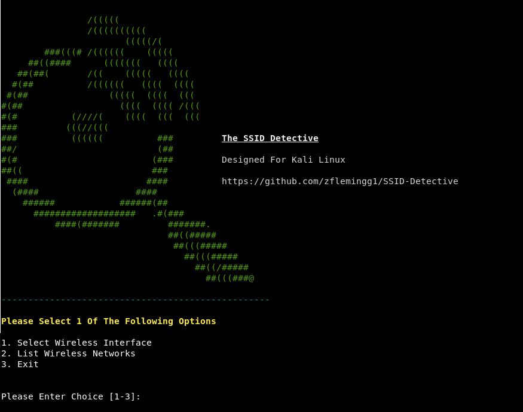
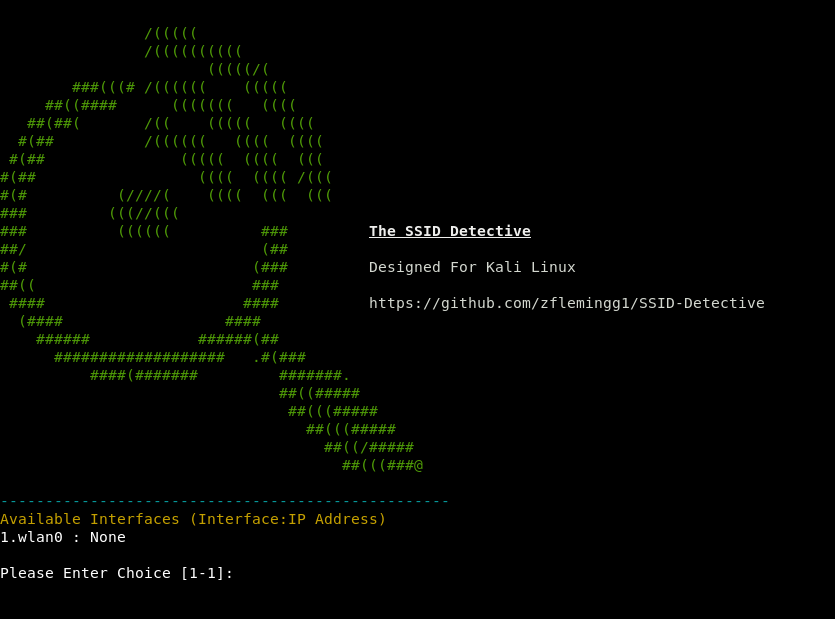
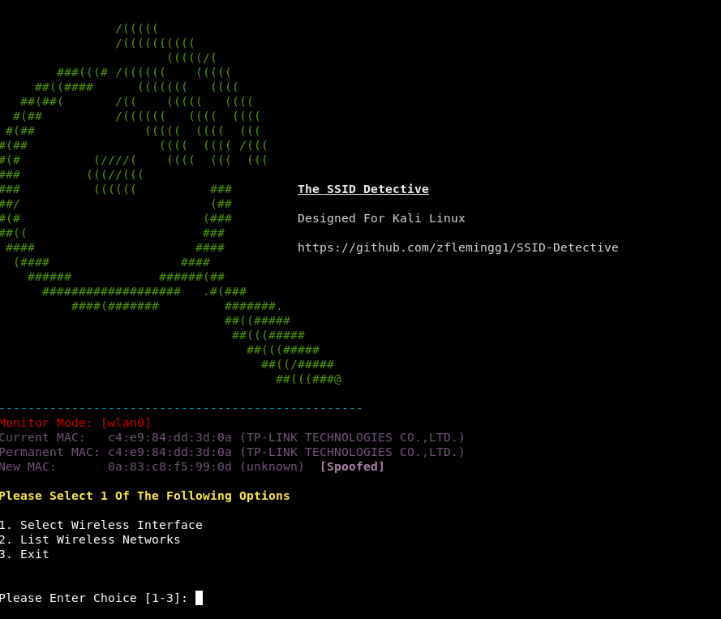
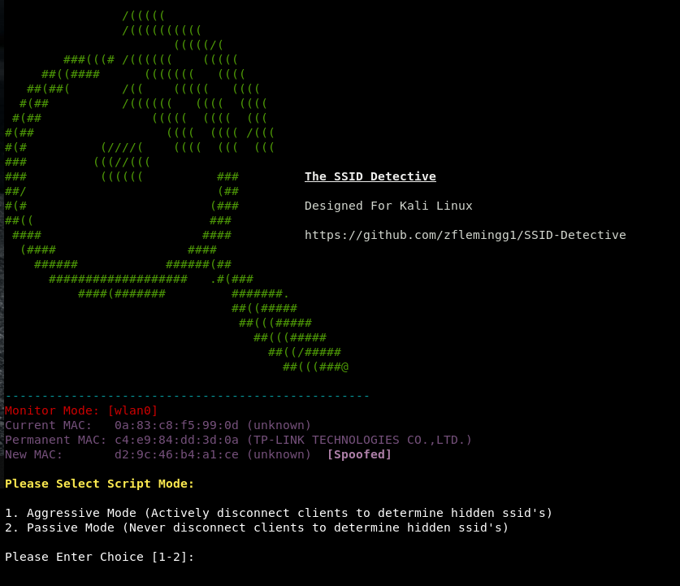
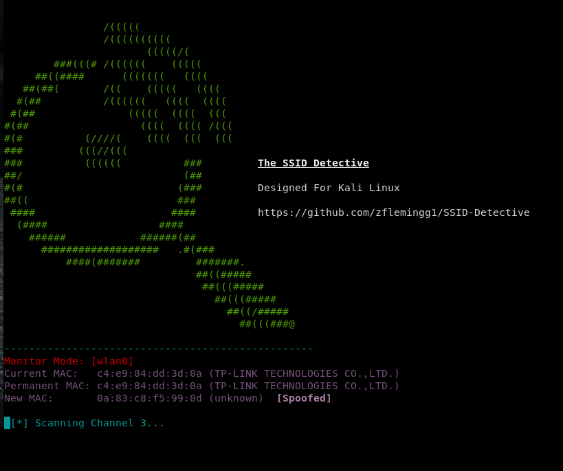
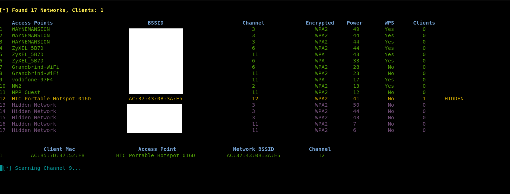
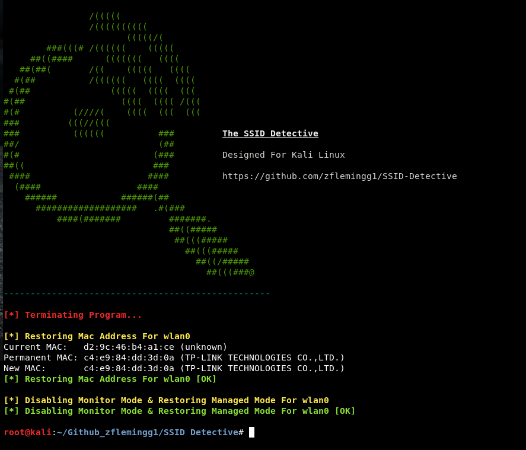

# SSID Detective
Simple Python tool to detect all available wireless networks within your local vicinity (including hidden networks). Can be run in either Passive mode (won't send deauthentication packets to a client on target ap) or Aggressive mode (will actively send deauthentication packets to a client on the target ap)

### Prerequisites

In order to be able to use this tool, you will need a network adaptor that supports packet injection and monitor mode. 

These are a couple that work out of the box with kali linux. 
	* Alfa AWUS036NEH 2.4 GHz
	* Panda PAU05 2.4 GHz
	* Alfa AWUS036NHA 2.4 GHz
	* TP-LINK TL-WN722N 2.4 GHz
	* Alfa AWUS051NH Dual Band 2.4 GHz & 5.8 GHz
	* Alfa AWUS036ACH 802.11ac AC1200 Wide-Range USB 3.0 Wireless Adapter with External Antenna
	* Alfa AWUS036H USB 2.4 GHz

### Setup
To set up the tool simply clone it i.e. git clone. Navigate into that directory and then enter  pip install -r requirements.txt into the command line. This will install the required python modules if not already installed on your system.

### Launching The Program
To use the program simply open up a terminal navigate to the directory and run it with "python 'ssid detective.py'"

### Running The Program

First step is selecting your wireless interface

Once you have selected your interface, it will spoof the mac address of the network adaptor and then put it into monitor mode

Next decide if you wish to run the program in eithr Passive mode, or Aggressive mode. Aggressive mode will actively send deauthentication packets to a client on the target ap in order to try and discover the ap's ssid. Passive mode will just listen until it sees a probe request and response from the hidden ssid. 

It will then start scanning the various channels looking for networks and clients

If there is a hidden network and it has clients connected if it is in aggressive mode, it will send  deauthentication packets to the client to disconnect them from that target ap. It will then listen for the probe request and response to try and determine the name of the hidden ssid.

To exit the program the user just has to press Ctrl+C. This will terminate the program and run the clean up process. The clean up process will restore the interfaces original mac address and put the interface back in managed mode. 

### Built With

* Python 2.7.14

### Authors

*** Zach Fleming --> zflemingg1@gmail.com

